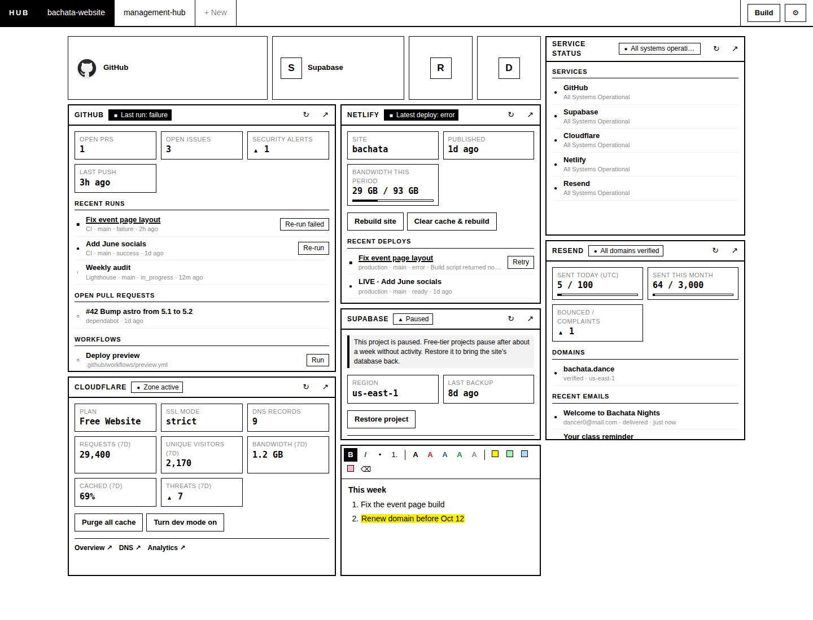
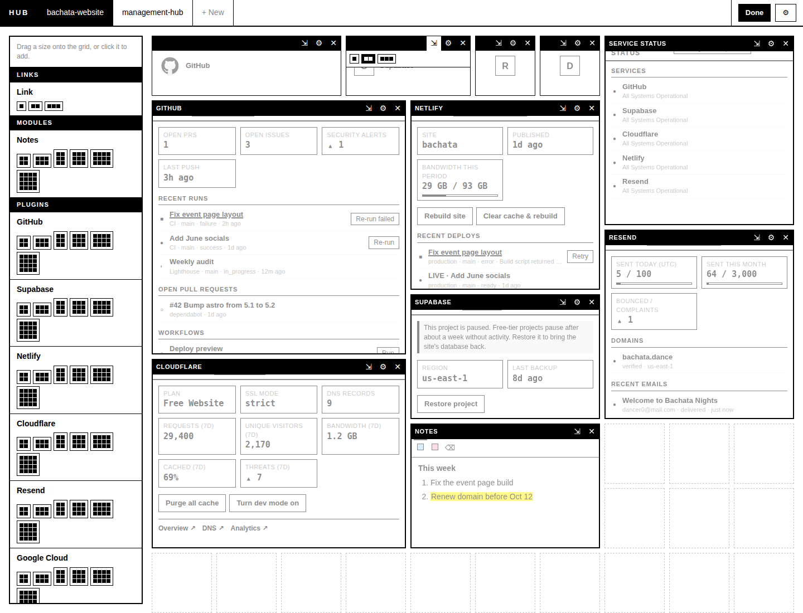

# Management Hub

A dashboard that runs on your own computer and puts the upkeep of your
other projects (GitHub, Supabase, Netlify, Cloudflare, Resend, Google Cloud)
in one place, so you don't need a dozen tabs and logins. It covers the three
reasons to visit those sites: taking maintenance actions, checking analytics,
and staying under billing limits.

The original request, what's built so far and what's planned are in
[docs/project-brief.md](docs/project-brief.md).



## What's in it

- **Projects** are listed across the top. `+ New` adds one.
- Each project is a **grid** of tools. The grid is 6 squares wide by default;
  change it (4 to 12) in project settings (⚙).
- **Build** turns on builder mode: drag tools from the left panel onto the
  grid (or click a size to drop it in the first free spot), drag tools around,
  change their size (⇲), edit their settings (⚙) or remove them (✕). Press
  **Done** when finished. Everything saves automatically.

  

- **Tools** come in three kinds:
  - **Links** (1, 2 or 3 squares wide) open a website or a file on your
    computer. They show the site's icon, and its name when wider than one square.
  - **Modules** are built into the hub. For now: **Notes**, rich text with
    lists, numbering, highlights and text colors.
  - **Plugins** show live information from a service and let you take its most
    common maintenance actions without opening the service's website:

| Plugin | Shows | Buttons |
|---|---|---|
| GitHub | Latest workflow runs, open PRs and issues, security alerts | Re-run (failed) workflows, run a workflow by hand |
| Supabase | Project status (paused?), service health, database size vs. limit, last backup | Restore a paused project, pause |
| Netlify | Recent deploys, bandwidth vs. plan | Rebuild, clear cache & rebuild, retry a failed deploy, roll back to an older deploy |
| Cloudflare | Zone status, SSL mode, DNS count, 7-day requests, visitors, bandwidth, cache rate, threats | Purge cache, toggle development mode |
| Resend | Domain verification, recent emails, emails sent today and this month vs. limits, bounces | Re-verify a domain, send a test email |
| Google Cloud | Open Google Cloud incidents | Shortcuts to the sign-in Audience, OAuth clients, branding, billing and quotas pages (Google has no API for these) |
| Service status | Live status of GitHub, Supabase, Cloudflare, Netlify and Resend | – |

Buttons that change something important ask before running.

## Setup

You need [Node.js](https://nodejs.org) 22.13 or newer.

```sh
npm install
cp .env.example .env     # Windows: copy .env.example .env
npm start
```

Fill in the tokens you want in `.env`, then open <http://localhost:8787>.
Plugins without a token show what to add.

**Tokens** live only in `.env` on your computer. It is never committed to git.
`.env.example` lists each one, where to create it and which permissions to give.
Restart the hub after editing `.env`.

**Your data** (projects, tools, notes) is one file: `data/hub.db`. Copy it to
back up the hub.

## Using it from your phone

The page adapts to phone screens (builder mode needs a larger screen). To reach
the hub from your phone privately:

1. Install [Tailscale](https://tailscale.com) on your computer and phone and
   sign in to both with the same account.
2. On the computer, run `tailscale serve --bg 8787`. It prints a private
   `https://…ts.net` address that only your devices can open.
3. Open that address on your phone and choose **Add to Home Screen**.

Your computer needs to be on for the phone to reach it.

## Commands

| Command | What it does |
|---|---|
| `npm start` | Build the page and run the hub |
| `npm run serve` | Run the hub without rebuilding the page (faster, if nothing changed) |
| `npm run dev` | Run with live reload while changing the code (page on port 5173) |
| `npm test` | Run the plugin tests |
| `npm run typecheck` | Check the code for type errors |
| `npm run check-plugins` | Try every plugin tile against the real services and report which ones fail |

## When a service changes its API

Each service is one file in `server/plugins/`. If a tile says **Plugin needs
an update**, run `npm run check-plugins` to see which one, then fix that file
(or ask Claude to). The page itself never needs to change for plugin fixes.

## How it's built

- `server/`: a small [Hono](https://hono.dev) server that stores data in SQLite
  and calls the services' APIs with your tokens, so tokens never reach the browser.
- `server/plugins/`: one file per service, plus `framework.ts` (shared
  helpers) and `index.ts` (the list of plugins).
- `web/`: the page, in React. Builder mode uses
  [react-grid-layout](https://github.com/react-grid-layout/react-grid-layout);
  notes use [Tiptap](https://tiptap.dev).
- `shared/types.ts`: types used by both sides, including the plugin "view"
  format every plugin returns.
